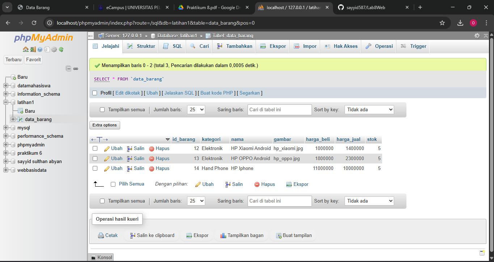
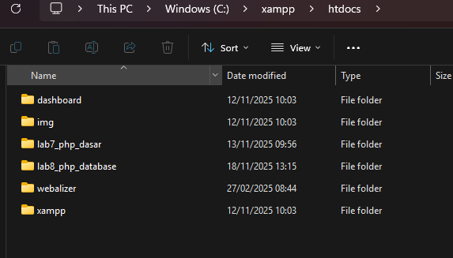
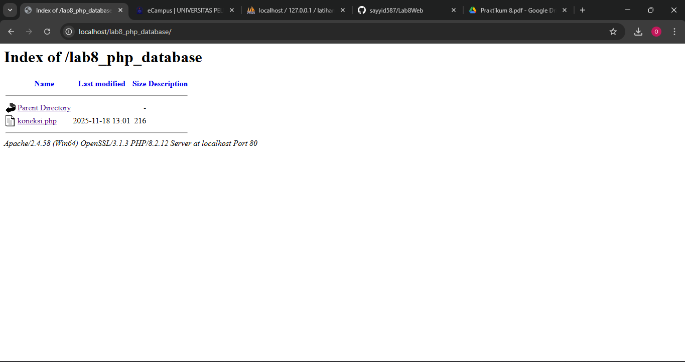
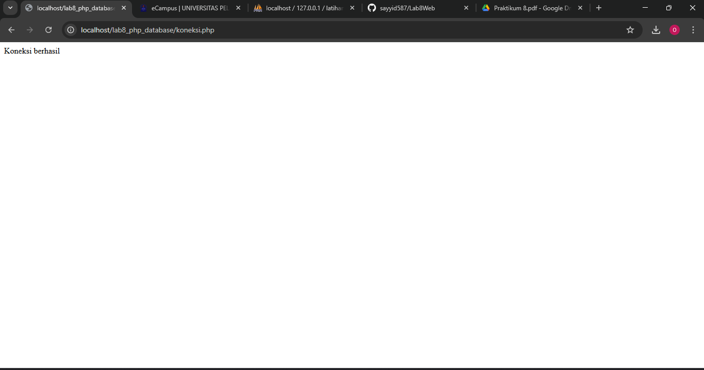
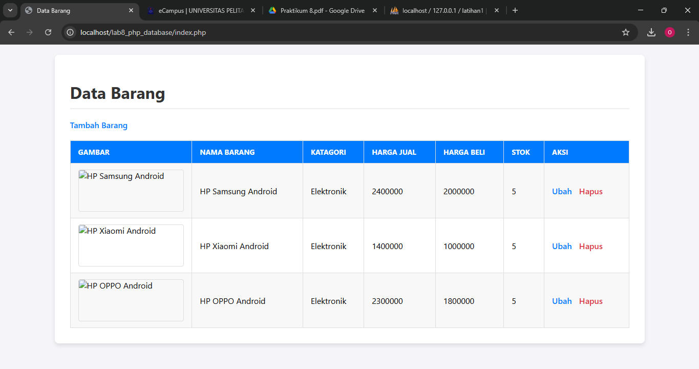
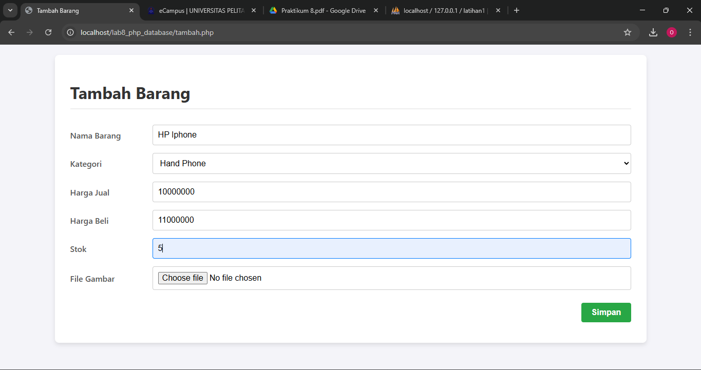
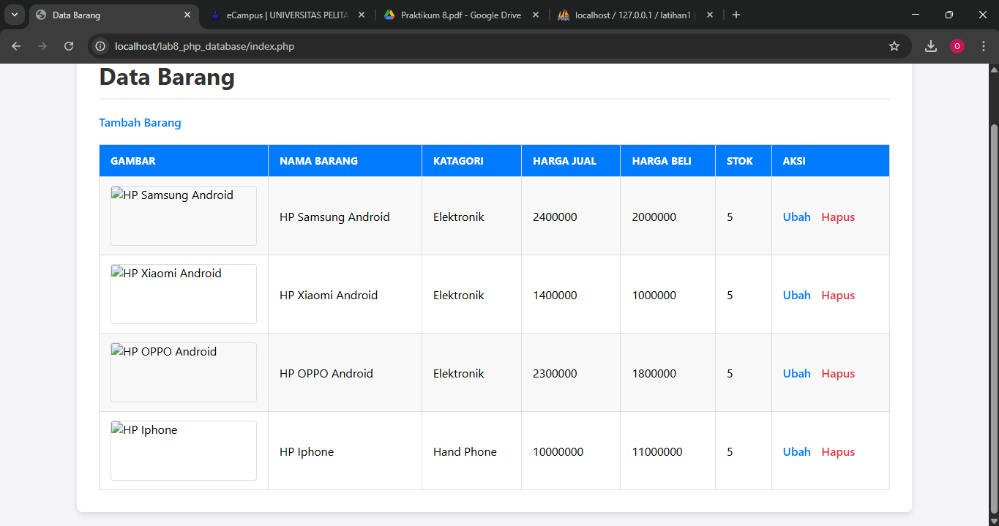
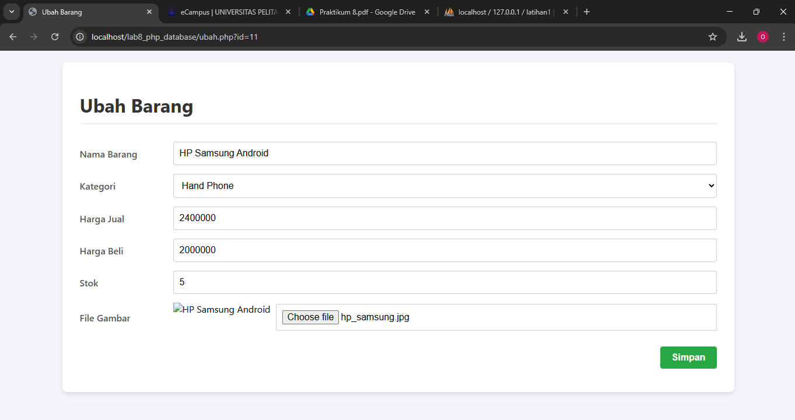
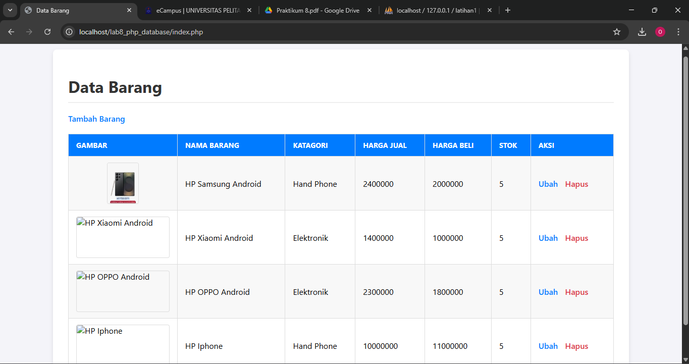
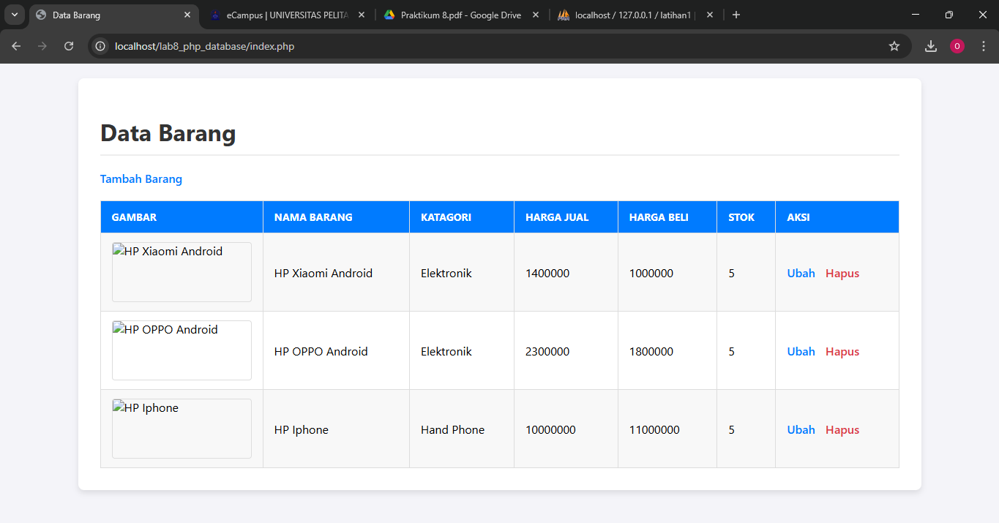

# Lab8Web

Nama : Sayyid Sulthan Abyan

NIM : 312410496

Kelas : TI.24.A.5

# Langkah-langkah Praktikum

## membbuat Database 

```sql
CREATE DATABASE latihan1;
```
**membuat tabel pada Database yang telah di buat**

```sql
CREATE TABLE data_barang (
id_barang int(10) auto_increment Primary Key,
kategori varchar(30),
nama varchar(30),
gambar varchar(100),
harga_beli decimal(10,0),
harga_jual decimal(10,0),
stok int(4)
);
```
**menambahkan data pada tabel**

```sql
INSERT INTO data_barang (kategori, nama, gambar, harga_beli, harga_jual, stok)
VALUES ('Elektronik', 'HP Samsung Android', 'hp_samsung.jpg', 2000000, 2400000, 5),
('Elektronik', 'HP Xiaomi Android', 'hp_xiaomi.jpg', 1000000, 1400000, 5),
('Elektronik', 'HP OPPO Android', 'hp_oppo.jpg', 1800000, 2300000, 5);
```


---

## Membuat Program CRUD
Buat folder `lab8_php_database pada` root directory web server (c:\xampp\htdocs)



Kemudian untuk mengakses direktory tersebut pada web server dengan mengakses URL:
http://localhost/lab8_php_database/



---

## Membuat file koneksi database
Buat file baru dengan nama `koneksi.php`
```php
<?php
$host = "localhost";
$user = "root";
$pass = "";
$db = "latihan1";
$conn = mysqli_connect($host, $user, $pass, $db);
if ($conn == false)
{
echo "Koneksi ke server gagal.";
die();
} else echo "Koneksi berhasil";
?>
```
Buka melalui browser untuk menguji koneksi database (untuk menyampilkan pesan
koneksi berhasil, uncomment pada perintah echo “koneksi berhasil”;




---

## Membuat file index untuk menampilkan data (Read)
Buat file baru dengan nama `index.php`




---

## Menambah Data (Create)
Buat file baru dengan nama `tambah.php`





---

## Mengubah Data (Update)
Buat file baru dengan nama `ubah.php`





---

## Menghapus Data (Delete)
Buat file baru dengan nama `hapus.php`



